# System Architecture Analysis

## Overview

- **Project**: /home/tom/github/semcod/heal
- **Primary Language**: python
- **Languages**: python: 5, shell: 1
- **Analysis Mode**: static
- **Total Functions**: 30
- **Total Classes**: 2
- **Modules**: 6
- **Entry Points**: 22

## Architecture by Module

### heal.cli
- **Functions**: 13
- **File**: `cli.py`

### heal.privacy
- **Functions**: 12
- **Classes**: 1
- **File**: `privacy.py`

### heal.main
- **Functions**: 5
- **Classes**: 1
- **File**: `main.py`

## Key Entry Points

Main execution flows into the system:

### heal.cli.test
> Test heal with a simulated error to verify configuration.
- **Calls**: main.command, click.echo, load_dotenv, os.getenv, os.getenv, os.getenv, PROVIDERS.get, heal.cli.get_litellm_model_name

### heal.cli.fix
> Fix shell errors using LLM.
- **Calls**: main.command, click.option, click.option, click.option, click.option, click.option, heal.cli.ensure_config, load_dotenv

### heal.cli.init
> Initialize bash integration for automatic command capture.
- **Calls**: main.command, CONFIG_DIR.mkdir, shell_hook_path.write_text, click.echo, click.echo, bashrc_path.exists, click.echo, click.echo

### heal.cli.config
> Configure or reconfigure heal settings (provider, API key, model).
- **Calls**: main.command, CONFIG_DIR.mkdir, load_dotenv, click.echo, os.getenv, os.getenv, os.getenv, heal.cli.ensure_config

### heal.privacy.PrivacyMasker._detect_secrets_scan
> Use detect-secrets to find and mask additional secrets.
- **Calls**: tempfile.NamedTemporaryFile, tmp.write, tmp.close, text.splitlines, set, os.unlink, None.join, default_settings

### heal.privacy.PrivacyMasker._priv_masker_scan
> Use priv-masker with Polish SpaCy model.
- **Calls**: self.nlp, analyse_text, mask_options.get, mask_options.get, mask_options.get, mask_options.get, mask_options.get, mask_options.get

### heal.cli.uninstall
> Remove shell hook and configuration.
- **Calls**: main.command, shell_hook_path.exists, output_file.exists, click.echo, shell_hook_path.unlink, click.echo, output_file.unlink, click.echo

### heal.privacy.PrivacyMasker.get_install_instructions
> Return install hints for missing backends.
- **Calls**: lines.append, lines.append, lines.append, lines.append, lines.append, lines.append, None.join

### heal.privacy.PrivacyMasker.available_backends
> Return list of available backend names.
- **Calls**: backends.append, backends.append, backends.append, backends.append, backends.append

### heal.privacy.PrivacyMasker.anonymize
> Run all available backends to anonymize *text*.

Order: secrets -> PII regex -> detect-secrets -> presidio -> priv-masker.
Each layer works on the res
- **Calls**: self._mask_secrets, self._mask_pii, self._detect_secrets_scan, self._presidio_scan, self._priv_masker_scan

### heal.cli.install
> Install shell hook for automatic error capture (legacy, use 'heal init' instead).
- **Calls**: main.command, click.echo, CliRunner, runner.invoke, click.echo

### heal.privacy.PrivacyMasker.__init__
- **Calls**: Faker, AnalyzerEngine, spacy.load, add_pipeline

### heal.privacy.PrivacyMasker._presidio_scan
> Use presidio-analyzer to detect and mask PII entities.
- **Calls**: self._presidio_engine.analyze, sorted

### heal.cli.main
> Heal - LLM-powered shell error fixing.
- **Calls**: click.group, ctx.invoke

### heal.privacy.PrivacyMasker._mask_secrets
> Mask secrets / credentials using built-in regex patterns.
- **Calls**: re.sub

### heal.privacy.PrivacyMasker._mask_pii
> Mask PII using built-in regex patterns.
- **Calls**: re.sub

### heal.main.hello
> Return a greeting message.

Returns:
    str: A friendly greeting message.

### heal.main.get_version
> Get the current version of the heal package.

Returns:
    str: The version string.

### heal.main.ShellHealer.__init__
> Initialize the ShellHealer.

Args:
    name (str): The name of the healer.

### heal.main.ShellHealer.heal
> Analyze and provide healing suggestions for shell errors.

Args:
    command (str): The command that failed.
    error_output (str): The error output.

### heal.main.ShellHealer.__str__

### heal.privacy.PrivacyMasker.is_available
> Return True - built-in regex backend is always available.

## Process Flows

Key execution flows identified:

### Flow 1: test
```
test [heal.cli]
```

### Flow 2: fix
```
fix [heal.cli]
```

### Flow 3: init
```
init [heal.cli]
```

### Flow 4: config
```
config [heal.cli]
```

### Flow 5: _detect_secrets_scan
```
_detect_secrets_scan [heal.privacy.PrivacyMasker]
```

### Flow 6: _priv_masker_scan
```
_priv_masker_scan [heal.privacy.PrivacyMasker]
```

### Flow 7: uninstall
```
uninstall [heal.cli]
```

### Flow 8: get_install_instructions
```
get_install_instructions [heal.privacy.PrivacyMasker]
```

### Flow 9: available_backends
```
available_backends [heal.privacy.PrivacyMasker]
```

### Flow 10: anonymize
```
anonymize [heal.privacy.PrivacyMasker]
```

## Key Classes

### heal.privacy.PrivacyMasker
> Multi-backend anonymizer for shell output before sending to LLM.

Combines multiple detection strate
- **Methods**: 10
- **Key Methods**: heal.privacy.PrivacyMasker.__init__, heal.privacy.PrivacyMasker.is_available, heal.privacy.PrivacyMasker.available_backends, heal.privacy.PrivacyMasker.get_install_instructions, heal.privacy.PrivacyMasker.anonymize, heal.privacy.PrivacyMasker._mask_secrets, heal.privacy.PrivacyMasker._mask_pii, heal.privacy.PrivacyMasker._detect_secrets_scan, heal.privacy.PrivacyMasker._presidio_scan, heal.privacy.PrivacyMasker._priv_masker_scan

### heal.main.ShellHealer
> A shell healer class for managing error fixing sessions.
- **Methods**: 3
- **Key Methods**: heal.main.ShellHealer.__init__, heal.main.ShellHealer.heal, heal.main.ShellHealer.__str__

## Data Transformation Functions

Key functions that process and transform data:

## Public API Surface

Functions exposed as public API (no underscore prefix):

- `heal.cli.test` - 141 calls
- `heal.cli.ensure_config` - 52 calls
- `heal.cli.fix` - 39 calls
- `heal.cli.init` - 33 calls
- `heal.cli.config` - 23 calls
- `heal.cli.uninstall` - 8 calls
- `heal.privacy.PrivacyMasker.get_install_instructions` - 7 calls
- `heal.privacy.PrivacyMasker.available_backends` - 5 calls
- `heal.privacy.PrivacyMasker.anonymize` - 5 calls
- `heal.cli.last_shell_command` - 5 calls
- `heal.cli.install` - 5 calls
- `heal.cli.get_last_output` - 4 calls
- `heal.cli.call_llm` - 4 calls
- `heal.privacy.get_privacy_status` - 3 calls
- `heal.cli.get_litellm_model_name` - 3 calls
- `heal.privacy.anonymize_shell_output` - 2 calls
- `heal.cli.read_stdin` - 2 calls
- `heal.cli.main` - 2 calls
- `heal.main.hello` - 0 calls
- `heal.main.get_version` - 0 calls
- `heal.main.ShellHealer.heal` - 0 calls
- `heal.privacy.PrivacyMasker.is_available` - 0 calls

## System Interactions

How components interact:

```mermaid
graph TD
    test --> command
    test --> echo
    test --> load_dotenv
    test --> getenv
    fix --> command
    fix --> option
    init --> command
    init --> mkdir
    init --> write_text
    init --> echo
    config --> command
    config --> mkdir
    config --> load_dotenv
    config --> echo
    config --> getenv
    _detect_secrets_scan --> NamedTemporaryFile
    _detect_secrets_scan --> write
    _detect_secrets_scan --> close
    _detect_secrets_scan --> splitlines
    _detect_secrets_scan --> set
    _priv_masker_scan --> nlp
    _priv_masker_scan --> analyse_text
    _priv_masker_scan --> get
    uninstall --> command
    uninstall --> exists
    uninstall --> echo
    uninstall --> unlink
    get_install_instruct --> append
    available_backends --> append
    anonymize --> _mask_secrets
```



## Reverse Engineering Guidelines

1. **Entry Points**: Start analysis from the entry points listed above
2. **Core Logic**: Focus on classes with many methods
3. **Data Flow**: Follow data transformation functions
4. **Process Flows**: Use the flow diagrams for execution paths
5. **API Surface**: Public API functions reveal the interface

## Context for LLM

Maintain the identified architectural patterns and public API surface when suggesting changes.